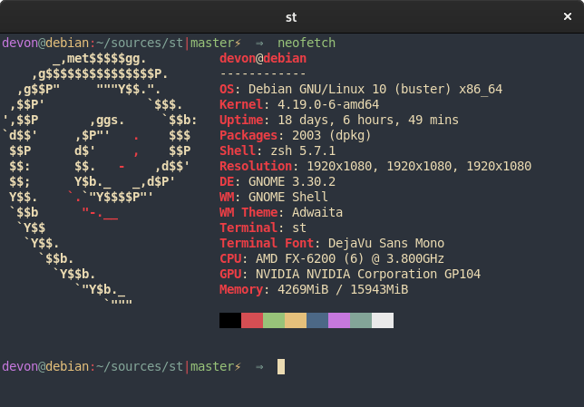

# st - simple (suckless) terminal
st is a simple terminal emulator for X which sucks less.



## Requirements
In order to build st you need the Xlib header files. You can get these on a
debian based system with
```
sudo apt install xorg-dev
```

## My tweaks
I applied the [scrollback](https://st.suckless.org/patches/scrollback/) and
[vertcenter](https://st.suckless.org/patches/vertcenter/) patches.

I also modified the colors to look like the
[vim-deus](https://github.com/ajmwagar/vim-deus). Shoutout to those guys for
making a great theme.

## Configuration
Look at the sauce `config.h` and edit it to make any changes to the colors or
keybindings.

## Installation
```
sudo make clean install
```

## Running st
It's as simple as running `st`. I'm sure you are smart enough to figure out
how to integrate this into your DE or WM.

See the man page for additional details.

Shoutout to the guys at [Suckless](https://st.suckless.org/) for making this a
great lightweight tool
